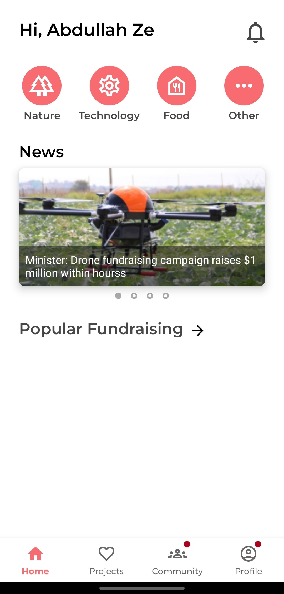

# XFund - Fundraising Community

<image align="right" src="./readme/xfund_icon.png" alt="Application Icon" width=17%>

XFund is a powerful mobile application committed to making a difference by addressing one of the world's most pressing challenges: eradicating poverty. Our mission aligns with the United Nations Sustainable Development Goal of "No Poverty."

## Description

Key Features:

- Donate to Projects:
  XFund allows users to contribute to a wide range of projects and initiatives dedicated to alleviating poverty. Your donations directly impact those in need.

- Community Engagement: Join vibrant discussions within the XFund community, where like-minded individuals collaborate and share insights on creating positive change.

- Transparency: We ensure complete transparency by sharing detailed information about every funded project, giving you the confidence that your contributions are making a tangible impact.

Platform:
XFund is available exclusively on [Android](https://www.android.com), built using [Android Studio](https://developer.android.com/studio) and [Kotlin](https://kotlinlang.org) to provide a seamless and user-friendly experience.

Join us on XFund and be a part of a global movement to end poverty. Together, we can turn dreams into reality.

## Screenshots

<table width="100%">
    <tr>
        <td width="25%" style="line-height:0;"></td>
        <td width="25%" style="line-height:0;"></td>
        <td width="25%" style="line-height:0;"></td>
        <td width="25%" style="line-height:0;"></td>
    </tr>
    <tr>
        <td width="25%" style="line-height:0;">
            
Home Screen

        </td>
        <td width="25%" style="line-height:0;">
            
Projects Screen

        </td>
        <td width="25%" style="line-height:0;">
            
Community Screen

        </td>
        <td width="25%" style="line-height:0;">
            
Profile Screen

        </td>
    </tr>
<table>

## Pre-requisites

- Android Phone
- Android Studio
- Gradle JDK: jbr-17

The compilation of Android projects requires Android Studio, you can enter [official website](https://developer.android.com/studio/install?hl=zh-cn) Follow the instructions to download and install.

## How to use

- Clone this project through `git clone`, or download the project file as a compressed package and unzip it.

- Open Android Studio and select in the initial `Welcome` interface
  `Open an existing Android Studio project`, open the Android project folder in the project.

- The Android project files are located in the `android/` folder of this project. Select the folder in the Android Studio prompt window. After the project is opened, the software may prompt that Gradle synchronization is required. Just agree and wait for the synchronization to complete.

- Connect the mobile phone in developer mode to the computer via USB cable. For specific connection methods, please refer to the [official tutorial](https://developer.android.com/studio/run/device?hl=zh-cn). If your phone model is correctly displayed on the right side of the toolbar at the top of the program, the device is connected successfully.

- If you are installing Android Studio for the first time, you may also need to install a series of development tools. Click the green triangle button `Run 'app'` in the upper right corner of the software interface to run the program directly. If there are tools that need to be installed, the system will prompt you, just follow the prompts to install them.

## Author

1. [Joshua Koh](https://github.com/Joshuakme)
2. [Lai Chee Sheng](https://github.com/EcasLai)
3. [Naik Kok Loong](https://github.com/NKokLoong)
4. [Shia Chai Fen](https://github.com/Tiffany72)
